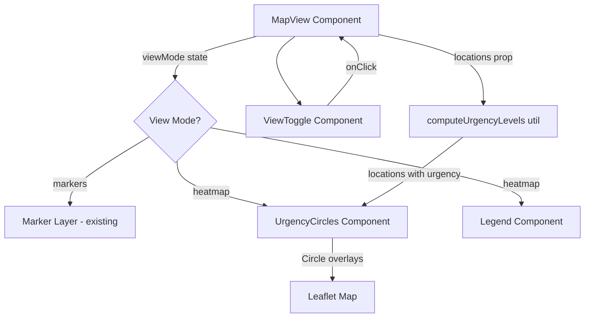

# Design Document: Heatmap Visualization (Density-Based Urgency Circles)

## Overview

This feature replaces the `leaflet.heat` gradient with density-based urgency circles on the existing `MapView` component. Each food pantry location gets a colored Leaflet Circle overlay based on how many other pantries are within a 2-mile radius — fewer nearby pantries means higher urgency (the area is underserved). The implementation uses native Leaflet `Circle` via react-leaflet's `Circle` component, eliminating the `leaflet.heat` dependency.

The design is intentionally minimal — an `UrgencyCircles` component replaces `HeatmapLayer`, a `Legend` component is added, and the `computeUrgencyLevels` utility replaces `toHeatPoints`. The existing `ViewToggle` and `MapView` structure remain largely the same.

### Key Design Decisions

1. **Native Leaflet Circle instead of leaflet.heat**: Using react-leaflet's `Circle` component eliminates the `leaflet.heat` plugin dependency. Each location gets its own circle colored by urgency level.

2. **Density-based urgency calculation**: Urgency is computed by counting nearby pantries within a 2-mile radius using the Haversine formula. This provides a meaningful metric — areas with fewer food resources are flagged as higher urgency.

3. **5-level urgency scale**: A simple 5-level scale (Low → Critical) maps density counts to colors, making the visualization immediately interpretable.

4. **Legend component**: A small overlay legend shows the 5 urgency levels and their colors so users understand what the circles mean.

## Architecture



### Component Hierarchy

```
MapContainer (existing)
├── TileLayer (existing)
├── MapSetup (existing)
├── ViewToggle (existing — overlay control)
├── Markers (existing, shown when viewMode === "markers")
├── UrgencyCircles (new, shown when viewMode === "heatmap")
└── Legend (new, shown when viewMode === "heatmap")
```

## Components and Interfaces

### 1. `UrgencyCircles` (replaces HeatmapLayer)

A child of `MapContainer` that renders Leaflet Circle overlays for each location.

```jsx
/**
 * Renders colored circle overlays on the map based on urgency levels.
 * Must be a child of MapContainer.
 *
 * @param {Object} props
 * @param {Array<{lat, lng, name, urgencyLevel, nearbyCount}>} props.locations - Locations with computed urgency
 */
function UrgencyCircles({ locations }) { ... }
```

**Behavior:**
- Renders a `<Circle>` for each location with valid coordinates
- Circle color is determined by `urgencyLevel` (1–5)
- Circle radius is 800 meters
- Fill opacity: 0.25, stroke opacity: 0.5, stroke weight: 1
- Each circle has a Popup showing the location name, urgency level label, and nearby pantry count

**Color mapping:**
```js
const URGENCY_COLORS = {
  1: '#22c55e', // Low - green
  2: '#fbbf24', // Moderate - yellow
  3: '#f97316', // Elevated - orange
  4: '#ef4444', // High - red
  5: '#b91c1c', // Critical - dark red
};
```

### 2. `Legend` (new component)

A small overlay showing the 5 urgency levels.

```jsx
/**
 * Legend overlay showing urgency level colors and labels.
 */
function Legend() { ... }
```

**Behavior:**
- Positioned bottom-right of the map container
- Shows 5 colored squares with labels: Critical, High, Elevated, Moderate, Low
- Semi-transparent white background so map is visible behind it

### 3. `computeUrgencyLevels` (replaces toHeatPoints)

```js
/**
 * Computes density-based urgency levels for each location.
 * Counts how many other pantries are within a 2-mile radius using Haversine formula.
 *
 * @param {Array<Object>} locations - Location records with lat and lng
 * @returns {Array<{lat, lng, name, urgencyLevel, nearbyCount}>} - Locations with urgency data
 */
function computeUrgencyLevels(locations) { ... }
```

**Urgency mapping:**
- 0–1 nearby pantries → Level 5 (Critical)
- 2–3 nearby pantries → Level 4 (High)
- 4–5 nearby pantries → Level 3 (Elevated)
- 6–8 nearby pantries → Level 2 (Moderate)
- 9+ nearby pantries → Level 1 (Low)

**Haversine helper:**
```js
function haversineDistance(lat1, lng1, lat2, lng2) { ... }
```
Returns distance in miles between two coordinates.

### 4. `ViewToggle` (unchanged)

No changes needed — still toggles between "markers" and "heatmap" modes.

### 5. `MapView` (modified)

Changes to the existing component:

- Replace `toHeatPoints` import with `computeUrgencyLevels`
- Replace `HeatmapLayer` import with `UrgencyCircles`
- Add `Legend` import
- Compute urgency data via `computeUrgencyLevels(validLocations)` instead of `toHeatPoints`
- Render `UrgencyCircles` and `Legend` when `viewMode === "heatmap"` instead of `HeatmapLayer`
- Remove `leaflet.heat` dependency usage

## Data Models

### Urgency Location

```ts
type UrgencyLocation = {
  lat: number;
  lng: number;
  name: string;
  urgencyLevel: 1 | 2 | 3 | 4 | 5;
  nearbyCount: number;
};
```

### View Mode

```ts
type ViewMode = "markers" | "heatmap";
```

### Data Flow

```
locations.json → MapView (locations prop)
                    ↓
              computeUrgencyLevels(locations)
                    ↓
              UrgencyLocation[] → UrgencyCircles → Leaflet Circle overlays
```

## Error Handling

| Scenario | Behavior | User Impact |
|----------|----------|-------------|
| UrgencyCircles component throws during render | Error boundary catches, sets `heatmapError = true`, forces markers mode | User sees markers view; toggle is hidden. Map remains functional. |
| `locations` prop is empty array | `computeUrgencyLevels` returns `[]`; no circles rendered | User sees empty map in heatmap mode — no crash. |
| Location record has `null`/`undefined`/`NaN` for lat or lng | `computeUrgencyLevels` excludes the record | Partial data renders correctly; no errors. |
| `locations` prop is `null` or `undefined` | `MapView` already defaults to `[]` via parameter default | No change from current behavior. |
